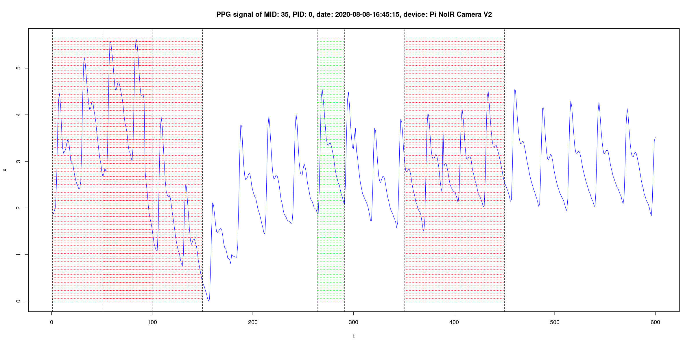

# ppg-signal-extraction

**Extraction of photoplethysmogram (PPG) signal from camera recording and assessment of PPG signal quality**

<figure>

<figcaption><strong>Figure 1:</strong> Example of extracted PPG signal (the good part of the signal is colored in green)</figcaption>
</figure>

## Introduction

To estimate the vital signs (e.g. blood pressure or blood glucose level) based on photoplethysmogram (PPG) signal from camera recording, 
we can built a data-driven model. This repository contains some scripts to create a dataset of measurements on which the model can be trained.

## Description

To capture PPG signal from a camera, you can try using the Python or Bash scripts in `scripts` directory:

* `capture-noir.py` - extracts frames from video captured by Raspberry Pi device using the camera without infrared filter;
* `convert-iphone.sh` - uses `ffmpeg` to extract frames from video captured by iPhone camera (video in QTFF format);
* `save-measurement.py` - extracts the PPG signal from provided video frames (images in PNG format) and saves the signal to a CSV file;

For more details, see the notebooks (written in R):

* [Definitions.ipynb](https://github.com/markolalovic/ppg-based-estimation/blob/master/notebooks/Definitions.ipynb) - example of generated dataset, PPG signal and the assessment of signal quality shown in **Figure 1**;
* [Analysis.ipynb](https://github.com/markolalovic/ppg-based-estimation/blob/master/notebooks/Analysis.ipynb) - more examples of extracted PPG signals;
